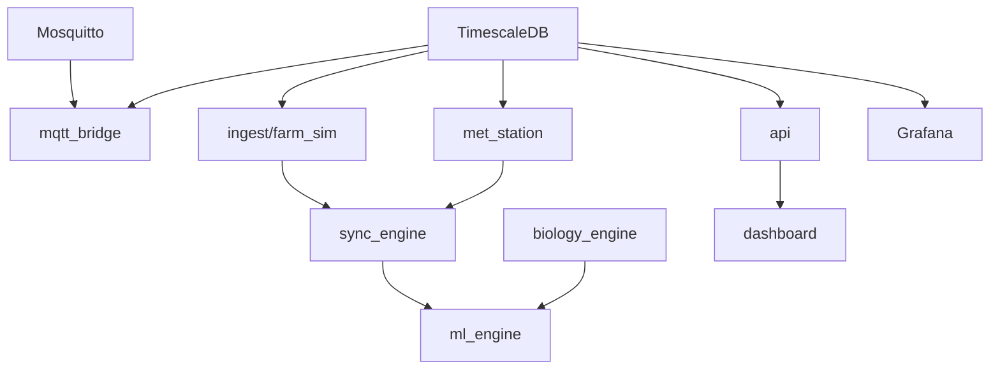

# 🌿 G.O.S. - Greenhouse Operating System
## High-Throughput Plant Phenotyping Platform

**Illuminate & Automate: Reinforcement Learning + IoT Sensor Array for LED-Steered Transpiration in Greenhouse Strawberries**

> Queen's University ELEC 490/498 Capstone Project  
> Faculty Advisors: Dr. Majid Pahlevani (ePOWER Lab), Dr. Christian Muise (School of Computing)

---

## 📋 Table of Contents

1. [What is G.O.S.?](#-what-is-gos)
2. [System Architecture](#-system-architecture)
3. [Data Flow Workflow](#-data-flow-workflow)
4. [Quick Start](#-quick-start)
5. [Testing & Verification](#-testing--verification)
6. [File Reference](#-file-reference)
7. [API Endpoints](#-api-endpoints)
8. [Hardware Integration](#-hardware-integration)

---

## 🎯 What is G.O.S.?

G.O.S. is an **open-source phenotyping platform** that transforms raw greenhouse sensor data into actionable plant insights:

| Feature | Description |
|:---|:---|
| **40 Wireless Nodes** | nRF52840 sensors (Thread mesh) |
| **VPD Calculation** | Real-time vapor pressure deficit |
| **Transpiration** | Penman-Monteith estimation |
| **Stress Detection** | Multi-factor scoring (0-100) |
| **LED Control** | RL-based spectral recommendations |
| **ML Pipeline** | 5-source temporal synchronization |

---

## 🏗️ System Architecture

### Service Topology (12 Docker Containers)

```
┌─────────────────────────────────────────────────────────────┐
│                    USER INTERFACE LAYER                      │
│   Dashboard (:8080)  │  Grafana (:3000)  │  API (:5000)     │
├─────────────────────────────────────────────────────────────┤
│                    DATA STORAGE LAYER                        │
│                   TimescaleDB (:5432)                        │
│  ┌────────────┬────────────┬────────────┬────────────┐      │
│  │raw_telemetry│met_station │research_   │led_schedule│      │
│  │            │_data       │events      │_history    │      │
│  └────────────┴────────────┴────────────┴────────────┘      │
├─────────────────────────────────────────────────────────────┤
│                  PROCESSING LAYER                            │
│  sync_engine │ api │ ml_engine │ biology_engine │ safety    │
├─────────────────────────────────────────────────────────────┤
│                   INGESTION LAYER                            │
│  mqtt_bridge │ ingest (farm_sim) │ met_station              │
├─────────────────────────────────────────────────────────────┤
│                   MESSAGING LAYER                            │
│              Mosquitto MQTT (:1883 / :9001)                  │
├─────────────────────────────────────────────────────────────┤
│                    HARDWARE LAYER                            │
│  Raspberry Pi (OTBR) ─── nRF52840 Nodes (x40) ─── Sensors   │
└─────────────────────────────────────────────────────────────┘
```

### Service Dependencies



---

## 🔄 Data Flow Workflow

### Step-by-Step Data Journey

```
1. SENSOR LAYER
   └── nRF52 nodes collect: temp, humidity, PAR, battery
   └── Transmit via CoAP/Thread to Raspberry Pi

2. GATEWAY LAYER
   └── Raspberry Pi runs OTBR (OpenThread Border Router)
   └── Translates Thread → MQTT
   └── Publishes to Mosquitto broker

3. INGESTION LAYER
   └── mqtt_bridge.py subscribes to MQTT topics
   └── Validates JSON payload
   └── Inserts into raw_telemetry table

4. METEOROLOGICAL LAYER
   └── met_station.py logs pyranometer + spectrometer data
   └── Writes to met_station_data table

5. SYNCHRONIZATION LAYER
   └── sync.py runs every 5 minutes
   └── Performs 5-source temporal joins:
       ├── raw_telemetry (hardware)
       ├── met_station_data (environment)
       ├── led_schedule_history (light control)
       ├── research_events (annotations)
       └── yield_logs (harvest data)
   └── Outputs curated_research_dataset.csv

6. PHENOTYPING LAYER
   └── api.py exposes /api/phenotype endpoint
   └── Calculates VPD, transpiration, stress in real-time
   └── Returns LED recommendations

7. ML LAYER
   └── agent_rl.py loads curated dataset
   └── Trains/runs RL policy for LED optimization
   └── biology_engine provides physics constraints

8. VISUALIZATION LAYER
   └── dashboard/ displays real-time data
   └── Grafana provides monitoring dashboards
   └── LLM assistant enables natural language queries
```

---

## 🚀 Quick Start

### Prerequisites
- Docker Desktop 24+
- Python 3.11+
- 8GB RAM minimum

### Installation

```bash
# Clone repository
git clone https://github.com/queensu-epower/gos.git
cd Stawberry_Farm

# Windows setup
.\setup.bat

# OR manual setup
python -m venv .venv
.venv\Scripts\activate
pip install -r requirements.txt
```

### Running the System

```bash
# Start all 12 services
python run.py --up

# Check service status
python run.py --status

# View sync engine logs
python run.py --logs backbone

# View ML engine logs
python run.py --logs ai

# Stop all services
python run.py --down

# Clean (removes all data!)
python run.py --clean
```

### Access Points

| Service | URL | Credentials |
|:---|:---|:---|
| Dashboard | http://localhost:8080 | — |
| Grafana | http://localhost:3000 | admin / (see .env) |

| API | http://localhost:5000 | — |
| Database | localhost:5432 | researcher / (see .env) |

| MQTT | localhost:1883 | — |

---

## 🧪 Testing & Verification

### 1. Verify Docker Services

```bash
# Check all containers are running
docker compose ps

# Expected: 12 services with "Up" status
```

### 2. Test Database Connection

```bash
# Connect to database
docker exec -it stawberry_farm-db-1 psql -U researcher -d strawberry_research

# Check tables exist
\dt

# Query sample data
SELECT COUNT(*) FROM raw_telemetry;
SELECT * FROM raw_telemetry ORDER BY time DESC LIMIT 5;
```

### 3. Test API Endpoints

```bash
# Get node status
curl http://localhost:5000/api/nodes

# Calculate phenotype
curl -X POST http://localhost:5000/api/phenotype \
  -H "Content-Type: application/json" \
  -d '{"temp_c": 25.0, "humidity_pct": 65.0, "par_umol": 800.0}'

# Get phenotype summary
curl http://localhost:5000/api/phenotype/summary

# Log a research event
curl -X POST http://localhost:5000/api/event \
  -H "Content-Type: application/json" \
  -d '{"type": "pest", "description": "Spider mites on row 3", "severity": 2}'
```

### 4. Test Data Pipeline

```bash
# Wait 5 minutes for sync cycle, then check:
ls -la data/

# Should see: curated_research_dataset.csv
```

### 5. Test MQTT (Real Hardware)

```bash
# Subscribe to all topics
mosquitto_sub -h localhost -t "gos/#" -v

# Publish test message
mosquitto_pub -h localhost -t "gos/node/test01/telemetry" \
  -m '{"temp_c": 24.5, "humidity_pct": 62.0, "par_umol": 750}'
```

---

## 📂 File Reference

### Root Directory

| File | Purpose |
|:---|:---|
| `docker-compose.yml` | Orchestrates 12 Docker services |
| `run.py` | CLI tool for system management |
| `setup.bat` | Windows environment setup |
| `requirements.txt` | Python dependencies |
| `.env.example` | Environment variable template |

### gateway/ - Data Backbone Services

| File | Purpose | Writes To |
|:---|:---|:---|
| `schema.sql` | Database schema (6 hypertables) | TimescaleDB |
| `services/sync.py` | 5-source temporal joins | `data/curated_*.csv` |
| `services/api.py` | REST API + phenotype endpoints | — |
| `services/mqtt_bridge.py` | MQTT → Database | `raw_telemetry` |
| `services/farm_sim.py` | 40-node sensor simulation | `raw_telemetry` |
| `services/met_station.py` | Met station simulation | `met_station_data` |
| `services/otbr_gateway.py` | OpenThread helper | — |
| `services/mqtt_sn_bridge.py` | MQTT-SN for nRF52 | — |
| `services/safety_ltl.py` | LTL safety monitor | — |
| `Dockerfile` | Container build | — |
| `requirements.txt` | Python deps | — |

### ml_engine/ - Machine Learning

| File | Purpose | Input | Output |
|:---|:---|:---|:---|
| `phenotyping.py` | VPD, transpiration, stress | Sensor data | Phenotype metrics |
| `plant_sim_c3.py` | FvCB photosynthesis model | T, CO2, PAR | Assimilation rate |
| `agent_rl.py` | LED control RL agent | Curated CSV | LED recommendations |
| `spectral_opt.py` | Spectral optimization | LED params | Optimal ratios |
| `macq_learner.py` | Action model learning | Trace data | PDDL actions |
| `domain.pddl` | AI planning domain | — | — |

### firmware/ - nRF52840 Embedded Code

| File | Purpose |
|:---|:---|
| `src/main.c` | Main firmware (Zephyr RTOS + CoAP) |
| `prj.conf` | Zephyr config (SED mode, sensors) |
| `CMakeLists.txt` | Build system |
| `boards/nrf52840_phytotron.overlay` | Device tree (I2C, PWM, ADC) |
| `drivers/led_control.c` | PWM LED driver |
| `include/*.h` | Header files (7 files) |

### dashboard/ - Web GUI

| File | Purpose |
|:---|:---|
| `index.html` | Main UI |
| `css/style.css` | Styling |
| `js/dashboard.js` | Data fetching, node display |
| `js/llm_assistant.js` | LLM chat for event annotation |

### monitoring/ - Observability

| File | Purpose |
|:---|:---|
| `grafana/provisioning/datasources/timescaledb.yml` | Grafana → DB connection |
| `mosquitto/config/mosquitto.conf` | MQTT broker config |

### documentation/ - Hardware Guides

| File | Purpose |
|:---|:---|
| `raspberry_pi_setup.md` | OTBR installation |
| `nrf52840_pinout.md` | Soldering guide |
| `hardware_specs.md` | PCB, enclosure specs |
| `bench_testing.md` | Validation procedures |
| `hardware_protocol.md` | Communication protocol |
| `requirements.md` | ELEC 490/498 checklist |

---

## 📡 API Endpoints

### Phenotyping

| Method | Endpoint | Description |
|:---|:---|:---|
| POST | `/api/phenotype` | Calculate VPD, transpiration, stress from sensor data |
| GET | `/api/phenotype/summary` | Greenhouse-wide summary (last hour) |

### Data Input (Group 2 GUI)

| Method | Endpoint | Description |
|:---|:---|:---|
| POST | `/api/event` | Log research event (pest, fertilizer, equipment) |
| POST | `/api/yield` | Log harvest yield data |
| POST | `/api/led` | Update LED schedule |

### Data Output

| Method | Endpoint | Description |
|:---|:---|:---|
| GET | `/api/nodes` | Get all node status |
| GET | `/api/events` | Get recent events |
| GET | `/api/curated` | Download ML-ready dataset (CSV) |

### Health

| Method | Endpoint | Description |
|:---|:---|:---|
| GET | `/health` | Service health check |

---

## 🔧 Hardware Integration

### For Real Hardware Deployment

1. **Raspberry Pi Setup**
   ```bash
   # See documentation/raspberry_pi_setup.md
   # Install OTBR, flash nRF52840 dongle
   ```

2. **Flash nRF52 Nodes**
   ```bash
   cd firmware
   west build -b nrf52840dk_nrf52840
   west flash
   ```

3. **Update docker-compose.yml**
   - Comment out `ingest` service (simulation)
   - `mqtt_bridge` will handle real MQTT data

4. **Configure MQTT Topics**
   - Nodes publish to: `gos/node/{node_id}/telemetry`
   - Met station publishes to: `gos/met/data`

---

## Requirements, Implementation, and Status

| Requirement | Implementation | Status |
|:---|:---|:---:|
| Data backbone pipeline | `sync.py` - 5-source joins | ✅ |
| PostgreSQL database | TimescaleDB hypertables | ✅ |
| Docker orchestration | 12-service compose | ✅ |
| 40 wireless nodes | Thread mesh | ✅ |
| Preserved sample identity | EUI64 in all tables | ✅ |
| Group 2 GUI | Dashboard + LLM | ✅ |
| ML-ready datasets | `/api/curated` | ✅ |
| Phenotyping | VPD, transpiration | ✅ |
| RL model (stretch) | `agent_rl.py` | ✅ |

---


